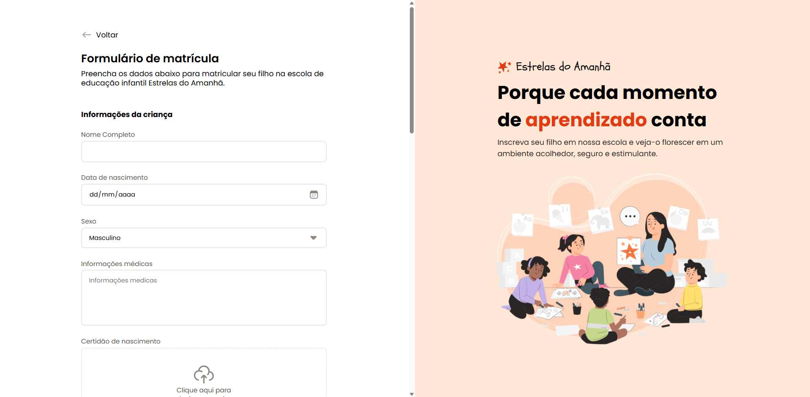

📝 Formulário de Matrícula - Módulo 4 | Curso Full Stack - Rocketseat
Este projeto é um formulário de matrícula desenvolvido como parte do Módulo 4 do Curso Full Stack da Rocketseat.

O principal objetivo foi aplicar os conceitos de HTML5 e CSS3, criando um formulário funcional e com um layout responsivo, utilizando apenas tecnologias puras — sem o uso de frameworks ou bibliotecas externas.

✅ Tecnologias utilizadas:
HTML5

CSS3

✅ Funcionalidades:
Estrutura de formulário com campos para matrícula.

Estilização moderna utilizando apenas CSS puro.

Layout responsivo para diferentes tamanhos de tela.

